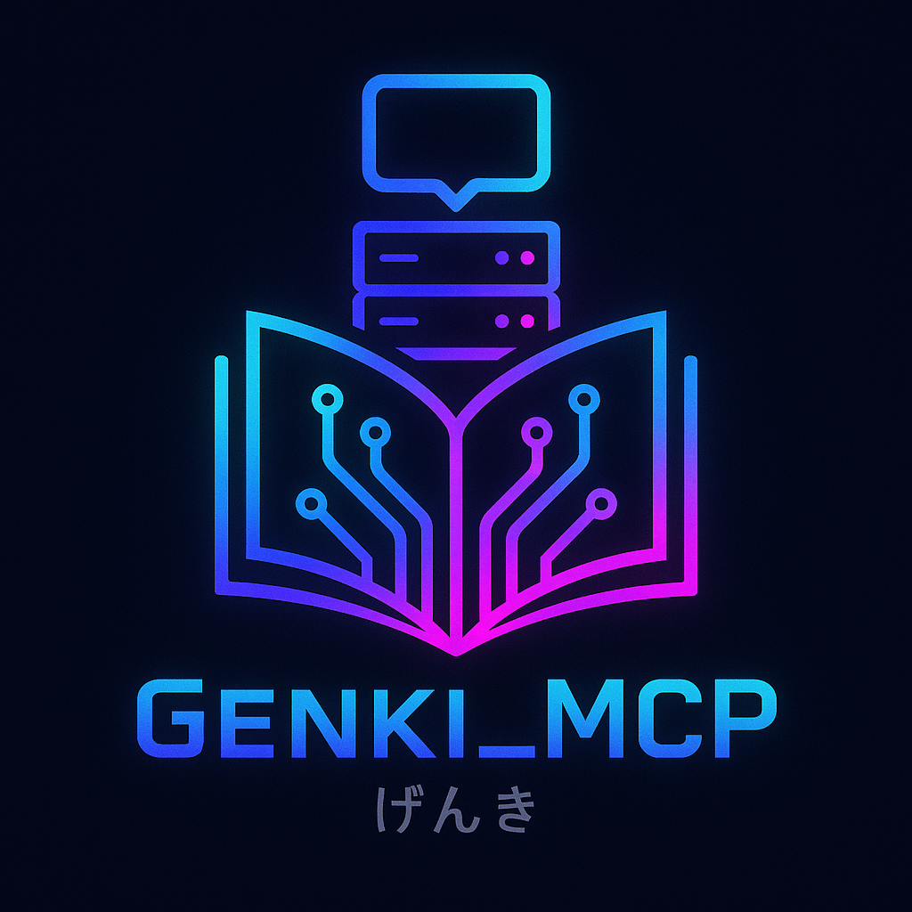

<h1 align="center">
Genki MCP
</h1>

<p align="center">

</p>

## Project Overview

**genki-mcp** is a Python project inspired by the structure and **conversational** content of the "Genki I" Japanese textbook (Second Edition). This project focuses **only on the conversational chapters and content** of the Genki book, and **does not include or cover the Reading and Writing sections** (which begin on page 289+ in the textbook). It provides structured chapter outlines and metadata, designed for language learners, educators, and developers interested in building tools or bots around the Genki textbook. This project does **not** include or distribute the original copyrighted text from the Genki book. Any references to content are based on publicly available information and user-supplied data. The structure and metadata are **inspired by** the Genki Second Edition textbook, but this project is not affiliated with or endorsed by the textbook's publishers.

---

## Features

- **Chapter Structuring**: Organizes chapter outlines and metadata inspired by the Genki textbook, with page ranges and summaries.
- **MCP Server**: Exposes chapter metadata and user-supplied content via an MCP (Modular Command Platform) server, enabling integration with bots, chat interfaces, or other tools.
- **Extensible Tools**: Provides MCP tools to list chapters and retrieve chapter outlines programmatically.
- **Jupyter Notebook (Optional)**: Includes a notebook for PDF parsing and OCR experimentation (requires Tesseract, only if you want to re-extract text from your own legally obtained copy).

---

## Directory Structure

```
.
├── main.py                  # Main entrypoint, runs the MCP server
├── pyproject.toml           # Project metadata and dependencies
├── .env                     # Environment variables (e.g., OpenAI API key)
├── data/
│   ├── Genki Textbook 2nd Edition.pdf   # (User-supplied) source textbook PDF (not included in repo)
│   ├── chapter_metadata.json            # Chapter metadata (conversational chapters only)
│   ├── lessons.json                     # Lesson-level metadata (conversational content)
│   ├── pages.json                       # Page-level extracted text (conversational content)
│   └── pdf_images/                      # (Likely) contains images of PDF pages (user-generated)
├── image/
│   └── genki_mcp_logo.png               # Project logo
├── notebooks/
│   ├── scanned_pdf_parsing.ipynb        # Jupyter notebook for PDF/OCR processing (optional)
│   └── chapters_to_lessons.ipynb        # Jupyter notebook for lesson/chapter mapping (optional)
├── .gitignore
├── .python-version
├── uv.lock
└── README.md                # This file
```

> **Note:** There is no `output/` directory by default. If you extract text using the provided notebook, you may create an `output/` directory for your own use.

---

## Installation

1. **Clone the repository:**
   ```bash
   git clone <repo-url>
   cd genki_mcp
   ```

2. **Install [uv](https://github.com/astral-sh/uv):**
   - On macOS: `brew install uv`
   - On Ubuntu: `curl -Ls https://astral.sh/uv/install.sh | sh`

3. **Install dependencies (recommended, reproducible):**
   ```bash
   uv pip sync
   ```
   This will install all dependencies exactly as specified in the lockfile (`uv.lock`).  
   If you do not have a lockfile yet, generate one with:
   ```bash
   uv pip compile pyproject.toml
   ```

4. **(Optional) Install development dependencies:**
   ```bash
   uv pip sync --dev
   ```

5. **Set up environment variables:**
   - Copy `.env.example` to `.env` and add your OpenAI API key (required for some features).

---

## Usage

### 1. **Run the MCP Server**

The MCP server uses structured chapter data and, optionally, user-supplied extracted text in `output/extracted_text.json`.

```bash
uv pip sync           # Ensure dependencies are installed and up to date
uv run main.py
```

- The server will load the structured data and expose MCP tools for chapter retrieval and listing.
- If you wish to use your own extracted text, ensure it is placed in `output/extracted_text.json`.

### 2. **Available MCP Tools**

- `get_genki_chapter(chapter_number: str)`: Retrieve structured outline for a specific chapter.
- `list_genki_chapters()`: List all available chapters with metadata.

These tools can be called programmatically or integrated into bots and chat interfaces using the MCP framework.

---

## Managing Dependencies

- **Add a new dependency:**  
  ```bash
  uv add <package-name>
  ```
- **Add a dev dependency:**  
  ```bash
  uv add --dev <package-name>
  ```
- **Update all dependencies:**  
  ```bash
  uv pip compile --upgrade pyproject.toml
  uv pip sync
  ```
- **Sync environment to lockfile:**  
  ```bash
  uv pip sync
  ```

---

## Optional: Extract Text from PDF (For Developers)

- If you want to extract text from your own legally obtained copy of the Genki PDF, use the Jupyter notebook `notebooks/scanned_pdf_parsing.ipynb`.
- **This step requires [Tesseract OCR](https://github.com/tesseract-ocr/tesseract) and is not needed for running the MCP server.**
- The output will be saved as `output/extracted_text.json`.
- You must provide your own copy of "Genki Textbook 2nd Edition.pdf" in the `data/` directory. This repository does not provide or distribute the textbook or its copyrighted content.

---

## Configuration

- **.env**: Store your OpenAI API key and other secrets here.
- **pyproject.toml**: Manage dependencies and project metadata.

---

## Dependencies

- Python 3.12+
- [uv](https://github.com/astral-sh/uv) (for dependency management)
- [mcp](https://pypi.org/project/mcp/) (Modular Command Platform)
- openai, httpx, ipykernel, pdf2image, pillow, pytesseract, python-dotenv
- **Tesseract OCR is only required if you want to use the notebook for re-extraction from your own copy.**

All Python dependencies are listed in `pyproject.toml`.

---
